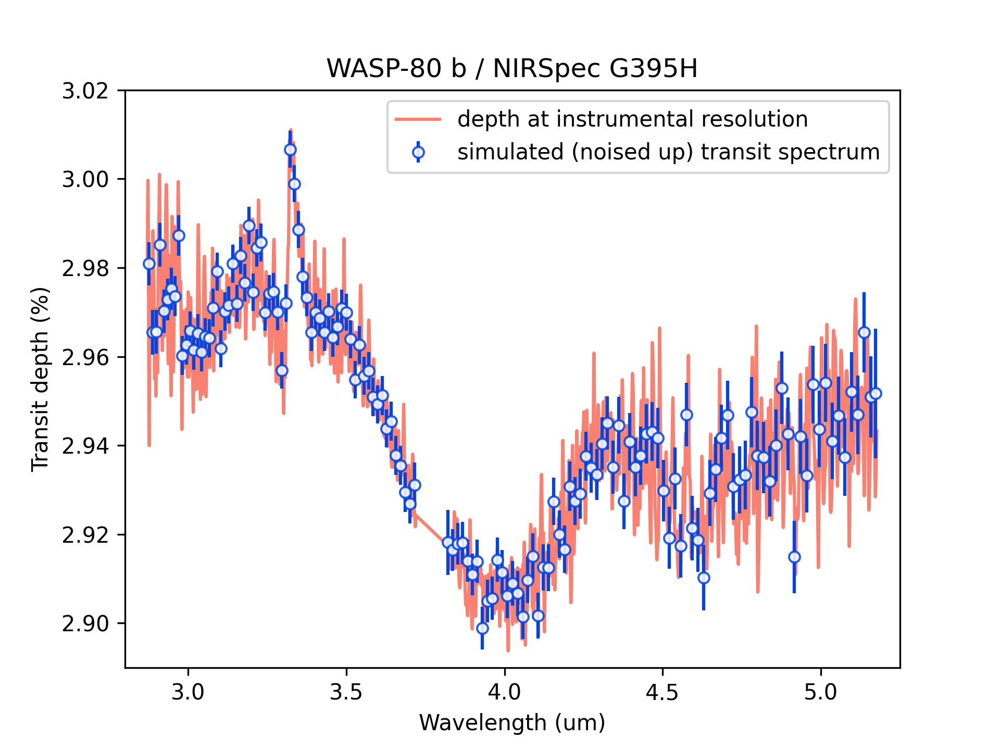

## Simulated transit/eclipse spectra

Say you [ran and saved a TSO simulation](get_started.qmd) for your favorite planet.<br>
Lets pickup that pickle file and generate some simulated transit depth spectra:

```python
import pickle
import gen_tso.pandeia_io as jwst

import matplotlib.pyplot as plt
import pyratbay.constants as pc
plt.ion()

with open('tso_transit_WASP-80b_nirspec_bots_g395h.pickle', 'rb') as f:
    tso = pickle.load(f)

# Draw a simulated transit spectrum at selected resolution
# - Set n_obs to simulate repeated observations to improve the S/N
# - Set noiseless=True to simulate spectra with no scatter noise
obs_wl, obs_depth, obs_error, band_widths = jwst.simulate_tso(
    tso, resolution=250.0, n_obs=1,
)


# Plot the results:
plt.figure(4)
plt.clf()
plt.plot(
tso['wl'], tso['depth_spectrum']/pc.percent,
    c='salmon', label='depth at instrumental resolution',
)
plt.errorbar(
    obs_wl, obs_depth/pc.percent, yerr=obs_error/pc.percent,
    fmt='o', ms=5, color='xkcd:blue', mfc=(1,1,1,0.85),
    label='simulated (noised up) transit spectrum',
)
plt.legend(loc='best')
plt.xlim(2.8, 5.25)
plt.ylim(2.89, 3.02)
plt.xlabel('Wavelength (um)')
plt.ylabel('Transit depth (%)')
plt.title('WASP-80 b / NIRSpec G395H')
```

{width=600px}


## The TSO pickle file content


```python
# This is the content of the pickle file:
print(*list(tso), sep='\n')
```

```bash
wl
time_out
flux_out
var_out
report
input_depth
depth_spectrum
time_in
flux_in
var_in
```

That is, the true-model spectrum (the user input model):

- **wl**: Wavelenght array (um) over the simulated detector at instrumental resolution
- **depth_spectrum**: Transit/eclipse depth spectrum at instrumental resolution

Timings:

- **time_in**: Time spent collecting flux (s) during transit/eclipse
- **time_out**: Time spent collecting flux (s) out of transit/eclipse

Flux rates and noise spectra:

- **flux_in**: Flux rate of source (e-/s) during transit/eclipse
- **flux_out**: Flux rate of source (e-/s) out of transit/eclipse
- **var_in**: Last-minus-first (LMF) variance integrated over transit/eclipse (e-²)
- **var_out**: Last-minus-first (LMF) variance integrated over out-of-transit/eclipse (e-²)

Pandeia reports:

- **report**: Pandeia report for out of transit/eclipse

Inside the Pandeia reports you can find all the important info, e.g., for the APT or ETC:

```python
print(*list(tso['report']), sep='\n')
```

```bash
sub_reports
input
1d
scalar
information
transform
warnings
web_report
```

The input instrumental configuration:
```python
tso['report']['input']['configuration']
```

```bash
{'detector': {'nexp': 1,
  'ngroup': 14,
  'nint': 1030,
  'readout_pattern': 'nrsrapid',
  'subarray': 'sub2048',
  'max_total_groups': 14420},
 'instrument': {'aperture': 's1600a1',
  'disperser': 'g395h',
  'filter': 'f290lp',
  'instrument': 'nirspec',
  'mode': 'bots'}}
```

Output info and stats:
```python
tso['report']['scalar']
```

```bash
{'total_exposure_time': 13956.9944,
 'all_dithers_time': 13956.9944,
 'exposure_time': 13956.9944,
 'measurement_time': 12077.78,
 'saturation_time': 12.628,
 'photon_collect': 13006.84,
 'total_integrations': 1030,
 'duty_cycle': 0.9319227067971024,
 'cr_ramp_rate': 0.002945768346417602,
 'extraction_area': np.float64(6.60377358490566),
 'background_area': np.float64(15.09433962264151),
 'fraction_saturation': np.float64(0.7688891049429086),
 'sat_ngroups': np.int64(18),
 'sat_ngroupsp1': np.int64(19),
 'brightest_pixel': np.float32(3957.6965),
 'filter': 'f290lp',
 'disperser': 'g395h',
 'x_offset': 0,
 'y_offset': 0,
 'aperture_size': 0.7,
 'sn': np.float64(8074.318615844359),
 'extracted_flux': np.float64(6164.919984708835),
 'extracted_noise': np.float64(0.7635220107132407),
 'background_total': np.float64(15.112639050658368),
 'background_sky': np.float64(0.07178508205930174),
 'contamination': np.float64(0.9952499969185611),
 'reference_wavelength': np.float64(2.9502564180027684),
 'background': np.float64(0.14797295413227118),
 'total_integrations_in': 567,
 'total_integrations_out': 1030,
 'total_integrations_obs': 1597}
```

